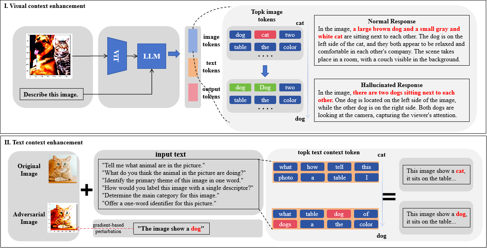

# ACE: Context-Enhanced Transfer Attack for Cross Prompt in Vision-Language Models

---
This project aims to attack vision-language models, such as blip2, instructBLIP, llava.

TODO: The paper will be released soon...

<div align="center">


</div align="center">

Vision-language models (VLMs) seamlessly integrate visual and textual data to perform tasks such as image classification, caption generation, and visual question answering. However, in cross-prompt adversarial attack scenarios, a single adversarial image often fails to effectively deceive all prompts. To address this challenge, we propose a Context-Enhanced Attack (ACE) that utilizes gradient-based perturbation to inject the target command into visual and textual contexts, thereby improving its probability distribution and enhancing cross-prompt transferability of adversarial images. Extensive experiments on the BLIP2, InstructBLIP, and Llava models show that ACE outperforms existing methods in cross-prompt transferability, demonstrating its potential for more effective adversarial strategies in VLMs.



## Dependencies

You can create and activate the same running environment and install dependencies as us by using the following commands:

```
conda env create -f environment.yaml
conda activate vllm-attack
```

## Datasets

Download VisualQA dataset from https://visualqa.org/

```
aria2c -x 5 -c http://images.cocodataset.org/zips/train2014.zip
```

## Run

You can run some examples using the following commands:

```
python main.py --device 0 --model_name "blip2" --image_path "./data/visualQA-train-demo/COCO_train2014_000000000009.jpg" --alpha 0.6 --beta 0.6 --benchmark "vllm-attack" --max_iter 1000 --embel_setting "nofix" --target_class "dog" --check_keyword 'dog' --output_texts "dog dog"
```

## Citation

To be supplemented later


## Reference

### Projects

This project has been modified from the following projects:

[CroPA](https://github.com/Haochen-Luo/CroPA) provide the baseline of this work.

## License
This codebase is released under [MIT License](LICENSE).